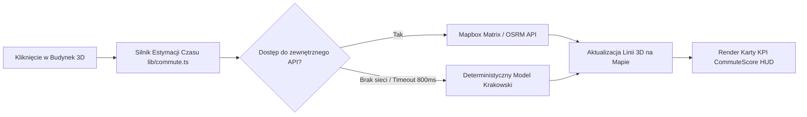

# CommuteScore 3D — Plan Funkcjonalności i Prezentacji (Hackathon PoC)

Dokument opisuje koncepcję, architekturę techniczną, prezentację wizualną 3D oraz scenariusz demonstracji funkcji analizy czasu dojazdu ze wskazanego budynku do kluczowych punktów życia użytkownika w Krakowie.

---

## 1. Koncepcja Produktowa & Storytelling dla Jury

* **Nazwa robocza:** *CommuteScore 3D / Tygodniowy Bilans Czasu*
* **Główny problem użytkownika:**  
  Szukając mieszkania lub biura w Krakowie, podejmujemy decyzję na podstawie ceny, metrażu czy ładnych zdjęć, ignorując kluczowy czynnik jakości życia: **ile godzin tygodniowo spędzimy w drodze do miejsc, które rzeczywiście regularnie odwiedzamy**.
* **Rozwiązanie:**  
  Użytkownik klika dowolny budynek w 3D na mapie Krakowa, a aplikacja w ułamku sekundy:
  1. Łączy go świetlistymi trajektoriami 3D z jego prywatnymi punktami życia (biuro, dom rodziców, siłownia, szkoła).
  2. Wylicza realne czasy dojazdu dla różnych środków transportu (MPK, samochód, rower, spacer).
  3. Oblicza syntetyczny **CommuteScore (0–100)** oraz **Tygodniowy Bilans Czasu w Drodze** (np. *„Zaoszczędzisz 3.5h tygodniowo względem średniej krakowskiej”*).

---

## 2. Warstwa Wizualna i Prezentacja Przestrzenna (Efekt WOW)

### A. Elementy na Mapie 3D (WebGL / Mapbox / MapLibre)

1. **Świetliste Trajektorie 3D (Commute Lines)**:
   * Od wybranego budynku wybiegają w przestrzeni 3D linie/łuki łączące go z punktami docelowymi.
   * **Kodowanie kolorystyczne czasu dojazdu**:
     * 🟢 **Zielony** ($< 15\text{ min}$): idea *miasta 15-minutowego*,
     * 🟡 **Żółty** ($15 - 30\text{ min}$): akceptowalny czas aglomeracyjny,
     * 🔴 **Czerwony** ($> 30\text{ min}$): wysokie ryzyko zmęczenia dojazdami.
2. **Pływające Etykiety 3D nad Celami**:
   * Nad każdym celem unosi się przestrzenny znacznik:  
     `[🏢 Biuro Zabłocie: 14 min (tramwaj)]`  
     `[🏠 Rodzina Nowa Huta: 22 min (samochód)]`
3. **Kamera Kinowa (Cinematic Overview)**:
   * Po kliknięciu budynku kamera płynnie oddala się i ustawia pod kątem $55^\circ$, obejmując cały układ celów w Krakowie.

### B. Pływający Panel HUD (Glassmorphism po lewej/prawej stronie)

* **Główny Kafelek KPI**:
  * `CommuteScore: 84 / 100` (duży, wyrazisty wskaźnik z kolorem oceny).
  * `Tygodniowo w drodze: 4h 20m` (*oszczędność: -2h 40m / tydz.*).
* **Przełącznik Środka Transportu**:
  * `🚋 MPK (Tramwaj/Autobus)` | `🚗 Samochód` | `🚲 Rower` | `🚶 Spacer`.
* **Rozbicie na Punkty Docelowe**:
  * Lista zdefiniowanych celów z czasem, odległością i częstotliwością wizyt (np. biuro $5\times$/tydz., rodzice $1\times$/tydz.).

---

## 3. Architektura Obliczeniowa (Gwarancja 100% Offline)

Na hackathonie aplikacja nie może zawieść z powodu braku sieci na scenie. Stosujemy **dwupoziomowy silnik estymacji**:



---

## 4. Struktury Danych (`types/commute.ts`)

```typescript
export type TravelMode = 'transit' | 'driving' | 'bicycling' | 'walking';

export interface CommuteDestination {
  id: string;
  name: string;
  category: 'work' | 'family' | 'hobby' | 'education' | 'other';
  icon: string;
  coordinates: [number, number]; // [lng, lat]
  frequencyPerWeek: number; // np. 5 dla pracy, 1 dla rodziny
}

export interface CommuteRouteResult {
  destinationId: string;
  destinationName: string;
  durationMinutes: number;
  distanceKm: number;
  travelMode: TravelMode;
  status: 'optimal' | 'moderate' | 'heavy'; // <15m zielony, 15-30m żółty, >30m czerwony
}

export interface CommuteProfile {
  id: string;
  name: string;
  icon: string;
  destinations: CommuteDestination[];
}
```

---

## 5. Plan Realizacji (4 Konkretne Kroki)

1. **Krok 1: Struktury Danych**
   * Utworzenie `types/commute.ts` z definicją celów i profili.

2. **Krok 2: Silnik Kalkulacji Czasu i Bilansu** (`lib/commute.ts`)
   * Funkcja `calculateCommute(originCoordinates, destinations, mode)` wyliczająca czasy, dystanse, punkty trajektorii i sumaryczny *CommuteScore*.

3. **Krok 3: Warstwa Wizualna na Mapie 3D** (`components/krakow-3d-map.tsx`)
   * Dynamiczne źródło GeoJSON dla linii dojazdowych (`commute-lines-source`) łączących kliknięty budynek z celami.
   * Warstwy linii z animacją/gradientem oraz kolorami zielony/żółty/czerwony.
   * Przestrzenne markery HTML lub Popupy nad celami z etykietami czasu.

4. **Krok 4: Panel Sterowania i Wyników (HUD)**
   * Kompaktowy, pływający komponent w prawym górnym/dolnym rogu z wynikiem *CommuteScore*, przełącznikiem transportu (`MPK / Auto / Rower / Pieszo`) .

---
