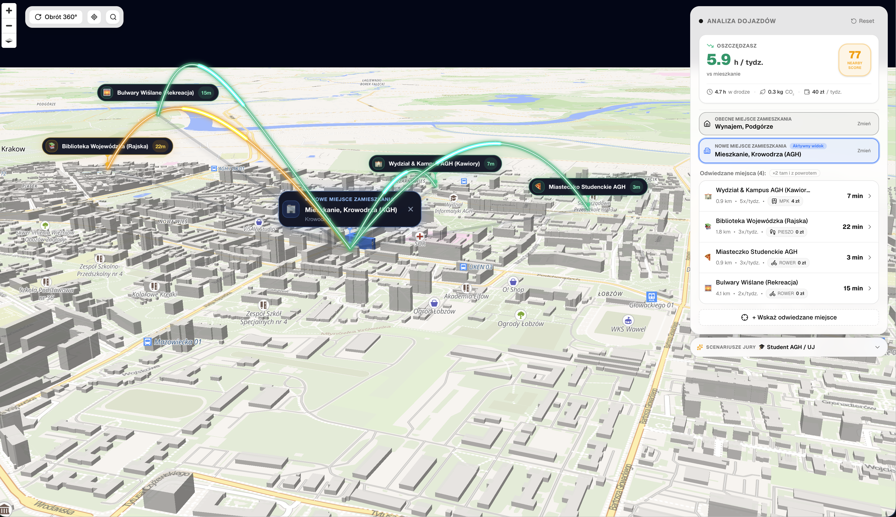
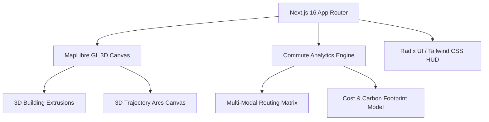

<div align="center">

# 🏙️ NearBy Score 3D
### Relational Urban Mobility & Commute Intelligence Platform

[](https://nextjs.org/)
[](https://react.dev/)
[](https://www.typescriptlang.org/)
[](https://tailwindcss.com/)
[](https://maplibre.org/)
[](https://hackathon-hackyeah.vercel.app/)
[](https://hackyeah.pl/)

<p align="center">
  <b>Transforming real estate and urban living decisions from static distance filters into a personalized, multi-destination 3D commute audit.</b>
</p>

[🌐 **Live Demo (Production)**](https://hackathon-hackyeah.vercel.app/) • [🎬 **Video Walkthrough (YouTube)**](https://youtu.be/otu_DwYSUmY) • [📊 **Presentation Slides (Google Drive)**](https://drive.google.com/file/d/1yv22LYz_oc4EaSoeeSoE0a38YRRmwRHC/view?usp=sharing)

---



</div>

---

## 📌 Quick Links

| Resource | Link | Description |
|---|---|---|
| 🚀 **Live Application** | [hackathon-hackyeah.vercel.app](https://hackathon-hackyeah.vercel.app/) | Zero-setup, instant browser demo |
| 🎥 **Video Pitch** | [YouTube Video (3 mins)](https://youtu.be/otu_DwYSUmY) | Product walkthrough & live scenario demo |
| 📑 **Slide Deck** | [Google Drive Presentation](https://drive.google.com/file/d/1yv22LYz_oc4EaSoeeSoE0a38YRRmwRHC/view?usp=sharing) | Problem statement, methodology & vision |
| 💻 **Source Code** | [GitHub Repository](https://github.com/execode-bartomiej-filipiak/hackathon-hackyeah) | Full open-source codebase |

---

## 🎯 The Problem

When searching for a new apartment or office, people look at price per square meter, floor plans, and photos — while largely guessing the impact on their daily mobility. 

* **The "15-minute city" myth:** Real estate listings rely on generic marketing claims like *"only 15 minutes to city centre"*. In reality, people don't commute to an abstract geometric center — they commute to their own personal anchors: offices, universities, schools, daycare, sports clubs, and parents' homes.
* **Hidden commute costs:** Drivers lose over 120 hours annually in city gridlock. Commuters face unpredictable public transit connections and mounting ticket or fuel expenses.
* **Lack of relational comparison:** There is no easy way to quantify: *"If I move from Apartment A to Apartment B, will I save 5 hours a week or lose 8 hours? How much money and CO₂ will it cost me annually?"*

---

## 💡 The Solution: NearBy Score

**NearBy Score** is an interactive 3D spatial mobility intelligence tool that replaces guesswork with a personalized commute audit:

1. **Relational Living Comparison:** Directly benchmark your **Current Residence** (*Obecne miejsce zamieszkania*) against a prospective **New Residence** (*Nowe miejsce zamieszkania*).
2. **Personal Life Anchors:** Build your unique daily routine by placing **Visited Places** (*Odwiedzane miejsca*) directly on the 3D map with customizable weekly frequencies (1x–5x/week).
3. **Multi-Modal Transit Intelligence:** Compute realistic commute times across 4 modes: **Public Transit (MPK)**, **Car**, **Bicycle**, and **Walking**.
4. **Actionable Impact Metrics:** Receive a single holistic **NearBy Score (0–100)** together with concrete balances:
   - **Hours saved/lost** per week and year.
   - **Commute budget impact** in PLN (transit pass vs fuel consumption).
   - **Carbon footprint impact** in kg CO₂ and tree absorption equivalents.

---

## ✨ Key Features

### 🏙️ 1. Interactive 3D Digital Twin
- Full WebGL-accelerated 3D vector map with extruded building heights and levels.
- Smooth camera choreography: 360° orbit rotation, variable pitch angle (up to 75°), and adaptive zoom.
- Interactive spatial pins and building highlight layers that adapt to selected locations.

### 🔀 2. Relational Commute Audit
- Instant side-by-side comparison between your existing home and prospective new addresses.
- Highlights whether a new location is an improvement or a downgrade before you sign a lease or mortgage.

### 🌈 3. Dynamic 3D Trajectory Arcs
- Ballistic 3D arcs rising gracefully over city rooftops connecting residences with visited places.
- Real-time color coding indicating commute feasibility:
  - 🟢 **Optimal** (< 15 min)
  - 🟡 **Moderate** (15–30 min)
  - 🔴 **Heavy** (> 30 min)

### 🎯 4. Visited Places Management (*Odwiedzane Miejsca*)
- Dedicated selection reticle: click any point or building directly on the 3D canvas.
- Automatic reverse-geocoding resolution to fetch real street names and building numbers.
- Tailored trip parameters: category, weekly visit frequency, and transport mode.

### 📊 5. Comprehensive Analytics HUD
- Real-time calculation of weekly hours spent in transit.
- Financial cost calculator (public transit ticket pricing vs car fuel costs at realistic consumption rates).
- Environmental impact breakdown with CO₂ emissions and tree offset metrics.

### 🧓 6. 1-Click Evaluation Presets
Pre-loaded demographic profiles for instant scenario testing:
- **🧓 Senior (65+):** 12 trips/week — health clinic, local fresh market, park, family.
- **🎓 Student (AGH / UJ):** 13 trips/week — university campus, library, student campus, riverside recreation.
- **👨‍👩‍👧 Young Family:** 14 trips/week — corporate office, primary school, preschool, supermarket, leisure.

### 🔍 7. Real-Time Address Search
- Fast address autocomplete search bar.
- Cinematic camera fly-to animation that smoothly transitions to the searched address and locks focus.

---

## 🛠️ Architecture & Tech Stack



| Layer | Technology | Details |
|---|---|---|
| **Framework** | Next.js 16 (App Router) | Turbopack, React 19, Server & Client Components |
| **Language** | TypeScript 5 | Strict type-safety, comprehensive route and analytics typing |
| **3D Map Engine** | MapLibre GL 6 + OpenFreeMap | WebGL vector tiles, 3D extruded polygon layers |
| **Canvas Graphics** | HTML5 2D/3D Canvas Layer | Synchronous ballistic arc rendering with particle pulse |
| **Styling & UI** | Tailwind CSS v4 + shadcn/ui | Radix UI primitives, Lucide Icons, Sonner notifications |
| **Deployment** | Vercel Edge Network | Automated CI/CD pipeline, global CDN delivery |

---

## 🚀 Getting Started

### Prerequisites
- **Node.js** 20.x or higher
- **npm** 10.x or higher

### Local Installation

1. **Clone the repository:**
   ```bash
   git clone https://github.com/execode-bartomiej-filipiak/hackathon-hackyeah.git
   cd hackathon-hackyeah
   ```

2. **Install dependencies:**
   ```bash
   npm install
   ```

3. **Start the development server:**
   ```bash
   npm run dev
   ```

4. **Open in browser:**
   Navigate to [http://localhost:3000](http://localhost:3000).

### Verification & Testing
```bash
# Type safety check
npm run typecheck

# Production build check
npm run build
```

---

## 🎮 How to Test (30-Second Demo Script)

1. Open the [Live Application](https://hackathon-hackyeah.vercel.app/).
2. Under **Scenariusze Jury** in the right HUD panel, click **"🎓 Student AGH / UJ"** or **"🧓 Senior (65+)"**.
3. Observe the camera framing the city in 3D with illuminated trajectory arcs connecting visited locations.
4. Review the top KPI card showing **Oszczędzasz X h / tydz.** and the **NearBy Score**.
5. Switch between **Obecne miejsce zamieszkania** and **Nowe miejsce zamieszkania** to view relational route changes.
6. Click **"+ Wskaż odwiedzane miejsce"**, aim the reticle at any building, and define a custom destination.

---

## 👥 Authors & Team

Developed with ❤️ during **HackYeah 2026** (Smart City Challenge):

- **Bartłomiej Filipiak**
- **Execode Team**

---

<div align="center">
  <sub>Built for HackYeah 2026 • Live at <a href="https://hackathon-hackyeah.vercel.app/">hackathon-hackyeah.vercel.app</a></sub>
</div>
